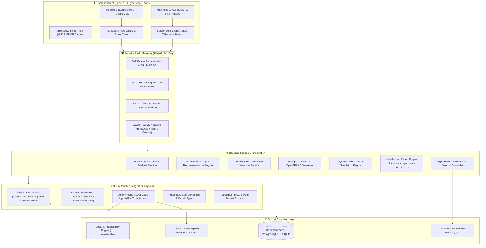
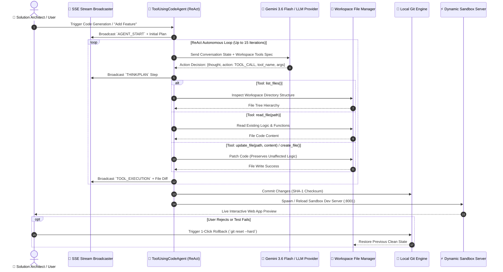
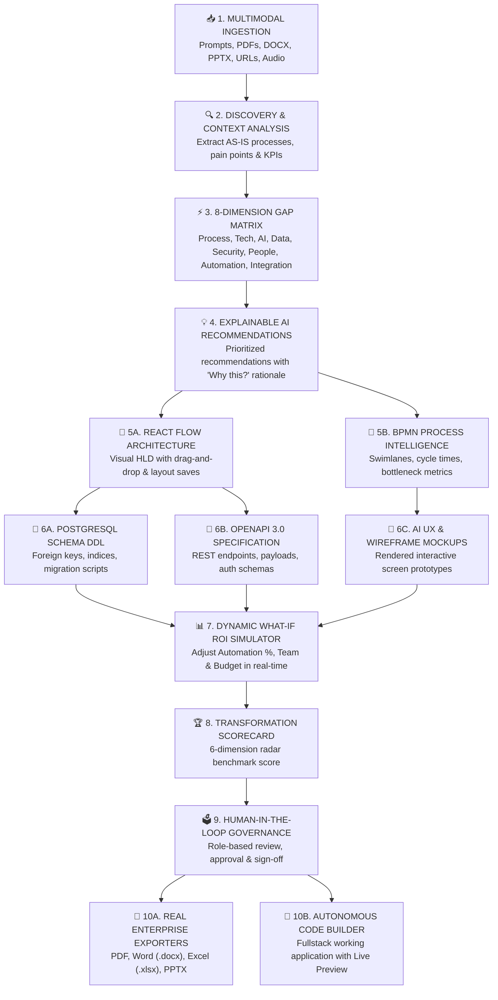
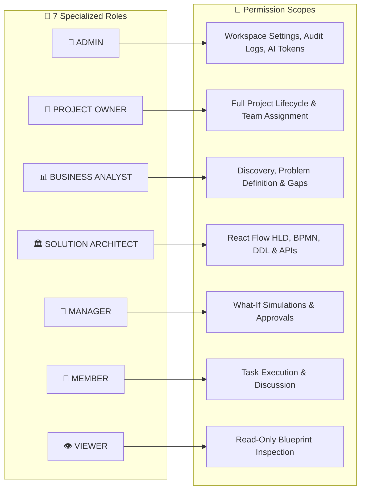

<div align="center">

# 🚀 TransformIQ — Autonomous AI Transformation OS & Solution Builder
### *From Business Chaos to Verifiable, Implementation-Ready Architecture, Code & Enterprise Blueprints*

[](https://github.com/ThummarDarshan/TransformIQ)
[](https://github.com/ThummarDarshan/TransformIQ)
[](https://fastapi.tiangolo.com)
[](https://reactjs.org)
[](https://neon.tech)
[](https://aistudio.google.com)
[](https://pytest.org)

<p align="center">
  <strong>TransformIQ</strong> is an enterprise-grade AI Transformation Operating System that takes messy business requirements, documents (PDF/DOCX/PPTX), live URLs, and voice transcripts, and autonomously generates <strong>8-dimension gap analyses, explainable AI solutions, interactive React Flow architectures, BPMN workflows, PostgreSQL DDL schemas, OpenAPI 3.0 contracts, UI wireframes, dynamic what-if ROI simulations, exportable enterprise documents</strong>, and a <strong>self-correcting autonomous code generation ReAct agent with live preview and Git rollback</strong>.
</p>

---

### 🏆 Chaos2Commit Hackathon 2026 Submission

| Field | Details |
| :--- | :--- |
| **Team Name** | **Eat-Code-Sleep** |
| **Track** | **AI** |
| **Team Lead** | **Darshan Thummar** ([`darshantce.059@gmail.com`](mailto:darshantce.059@gmail.com)) |
| **Team Members** | **Shreeja Upadhyay**, **Kishan Vadsola**, **Vishv Undavia** |
| **Backend Deployment** | **Render Web Service** (FastAPI + Asyncpg + Neon PostgreSQL) |
| **Frontend Deployment** | **Vercel Edge** (React 18 + TypeScript + Vite + TailwindCSS) |
| **Repository** | [`https://github.com/ThummarDarshan/TransformIQ`](https://github.com/ThummarDarshan/TransformIQ) |

---

</div>

## 📌 Table of Contents

1. [Executive Summary & Problem Statement](#1-executive-summary--problem-statement)
2. [End-to-End System Architecture](#2-end-to-end-system-architecture)
3. [Database Entity Relationship (ER) Diagram](#3-database-entity-relationship-er-diagram)
4. [Autonomous AI Code Generator (ReAct Loop)](#4-autonomous-ai-code-generator-react-loop)
5. [Transformation Pipeline Lifecycle & Sequence Flow](#5-transformation-pipeline-lifecycle--sequence-flow)
6. [Core Feature Breakdown & Innovations](#6-core-feature-breakdown--innovations)
7. [Enterprise Security, RBAC & Governance](#7-enterprise-security-rbac--governance)
8. [Technology Stack](#8-technology-stack)
9. [Local Quick Start & Execution Guide](#9-local-quick-start--execution-guide)
10. [Cloud Deployment Guide (Render, Vercel & Neon)](#10-cloud-deployment-guide-render-vercel--neon)
11. [REST API Catalog](#11-rest-api-catalog)
12. [Automated Testing & Security Validation](#12-automated-testing--security-validation)
13. [Pre-Seeded 1-Click Evaluation Accounts](#13-pre-seeded-1-click-evaluation-accounts)
14. [Hackathon Compliance Matrix](#14-hackathon-compliance-matrix)

---

## 1. Executive Summary & Problem Statement

### 💥 The Problem: Enterprise Transformation is Broken
Traditional enterprise consulting and technical architecture discovery is **slow, high-friction, siloed, and cost-prohibitive**:
- **Months of Discovery**: Teams spend 3–6 months conducting stakeholder interviews, reading unstructured documents, and manually mapping legacy architectures.
- **Disconnected Deliverables**: Business analysts write Word documents, architects build static Visio diagrams, developers draft OpenAPI specs, and PMs build Excel ROI models—creating communication silos and stale specifications.
- **Black-Box AI**: Generic LLMs produce superficial text without verifiable data schemas, explainable rationale, executable code, or interactive architecture diagrams.
- **High Financial Cost**: Enterprises spend $250,000 to $1,500,000+ per transformation initiative with high failure rates.

### 💡 The Solution: TransformIQ
**TransformIQ** combines an autonomous **AI Business Consultant + Business Analyst + Solution Architect + Fullstack Engineer + Product Strategist** into a unified, collaborative platform.

```
┌──────────────────────────────────────┐       ┌──────────────────────────────────────┐       ┌──────────────────────────────────────┐
│            BUSINESS CHAOS            │  ──►  │        TRANSFORMIQ AI ENGINE         │  ──►  │      PRODUCTION-READY ARTIFACTS      │
│ • Messy Prompts & Transcripts        │       │ • Multimodal Ingestion (RAG)         │       │ • Interactive React Flow HLD Canvas  │
│ • PDFs, Word Docs (.docx), PPTX      │       │ • 8-Dimension Gap Matrix             │       │ • BPMN Cycle Time Workflows          │
│ • Live System URLs & Web Pages       │       │ • Explainable AI ("Why this?")       │       │ • PostgreSQL Schema & DDL Scripts    │
│ • Voice & Multi-lingual Input        │       │ • Dynamic What-If ROI Simulator      │       │ • OpenAPI 3.0 REST Specs             │
│   (English, Hindi, Gujarati)         │       │ • Autonomous ReAct Code Builder      │       │ • Real PDF, DOCX, XLSX, PPTX Exports │
└──────────────────────────────────────┘       └──────────────────────────────────────┘       └──────────────────────────────────────┘
```

---

## 2. End-to-End System Architecture



---

## 3. Database Entity Relationship (ER) Diagram

The following comprehensive Mermaid ER Diagram models all relational tables, primary keys, foreign key constraints, and 1-to-many / many-to-many associations in TransformIQ:

```mermaid
erDiagram
    ORGANIZATIONS ||--o{ WORKSPACES : contains
    WORKSPACES ||--o{ PROJECTS : contains
    ORGANIZATIONS ||--o{ USERS : belongs_to
    PROJECTS ||--o{ PROJECT_MEMBERS : assigns
    USERS ||--o{ PROJECT_MEMBERS : assigned_as

    PROJECTS ||--o| BUSINESS_CONTEXTS : has
    PROJECTS ||--o{ DOCUMENTS : contains
    DOCUMENTS ||--o{ DOCUMENT_CHUNKS : splits_into

    PROJECTS ||--o{ REQUIREMENTS : specifies
    PROJECTS ||--o{ STAKEHOLDERS : identifies
    PROJECTS ||--o{ BUSINESS_PROCESSES : analyzes
    PROJECTS ||--o{ GAPS : discovers
    PROJECTS ||--o{ RECOMMENDATIONS : provides
    PROJECTS ||--o| SOLUTIONS : designs

    PROJECTS ||--o{ ARCHITECTURE_COMPONENTS : contains
    ARCHITECTURE_COMPONENTS ||--o{ ARCHITECTURE_CONNECTIONS : source_of
    ARCHITECTURE_COMPONENTS ||--o{ ARCHITECTURE_CONNECTIONS : target_of

    PROJECTS ||--o{ WORKFLOW_NODES : models
    WORKFLOW_NODES ||--o{ WORKFLOW_EDGES : routes_from
    WORKFLOW_NODES ||--o{ WORKFLOW_EDGES : routes_to

    PROJECTS ||--o{ DATABASE_ENTITIES : defines
    PROJECTS ||--o{ API_ENDPOINTS : publishes
    PROJECTS ||--o{ WIREFRAMES : prototypes

    PROJECTS ||--o{ ROADMAPS : schedules
    PROJECTS ||--o{ ESTIMATES : budgets
    PROJECTS ||--o{ RISKS : tracks
    PROJECTS ||--o{ TRANSFORMATION_SCORES : scores
    PROJECTS ||--o{ SIMULATION_SCENARIOS : simulates

    PROJECTS ||--o{ CONVERSATIONS : hosts
    CONVERSATIONS ||--o{ MESSAGES : contains
    PROJECTS ||--o{ APPROVALS : governs
    PROJECTS ||--o{ COMMENTS : discusses
    PROJECTS ||--o{ VERSIONS : snapshots
    PROJECTS ||--o{ AUDIT_LOGS : records
    PROJECTS ||--o{ EXPORT_JOBS : exports
    PROJECTS ||--o{ APP_BUILDER_SESSIONS : generates

    ORGANIZATIONS {
        string id PK
        string name
        string slug
        string tier
        datetime created_at
    }

    USERS {
        string id PK
        string email UK
        string full_name
        string role
        string hashed_password
        boolean is_active
        datetime created_at
    }

    WORKSPACES {
        string id PK
        string organization_id FK
        string name
        string description
        datetime created_at
    }

    PROJECTS {
        string id PK
        string workspace_id FK
        string name
        string industry
        string business_problem
        string business_objective
        string status
        datetime created_at
    }

    BUSINESS_CONTEXTS {
        string id PK
        string project_id FK
        string current_state_description
        string target_state_vision
        json key_pain_points
        json target_kpis
        json compliance_requirements
    }

    DOCUMENTS {
        string id PK
        string project_id FK
        string filename
        string file_type
        string file_size
        string file_path
        string processing_status
    }

    DOCUMENT_CHUNKS {
        string id PK
        string document_id FK
        text chunk_text
        int chunk_index
        json metadata
    }

    REQUIREMENTS {
        string id PK
        string project_id FK
        string code
        string title
        string req_type
        string priority
        text description
    }

    STAKEHOLDERS {
        string id PK
        string project_id FK
        string name
        string role
        string department
        string influence
        string interest
    }

    GAPS {
        string id PK
        string project_id FK
        string category
        string title
        text current_state
        text desired_state
        string severity
        string impact
        text recommended_action
    }

    RECOMMENDATIONS {
        string id PK
        string project_id FK
        string category
        string title
        text description
        text reason
        string expected_impact
        string priority
        float confidence_score
        string status
    }

    SOLUTIONS {
        string id PK
        string project_id FK
        string name
        string tagline
        text executive_summary
        json technology_stack
        json key_capabilities
        string expected_roi
    }

    ARCHITECTURE_COMPONENTS {
        string id PK
        string project_id FK
        string name
        string layer
        string tech_stack
        text description
        float position_x
        float position_y
    }

    ARCHITECTURE_CONNECTIONS {
        string id PK
        string project_id FK
        string source_component_id FK
        string target_component_id FK
        string protocol
        string data_payload
        boolean is_async
    }

    WORKFLOW_NODES {
        string id PK
        string project_id FK
        string node_key
        string node_type
        string label
        string actor
        string system
        float position_x
        float position_y
    }

    WORKFLOW_EDGES {
        string id PK
        string project_id FK
        string source_node_key
        string target_node_key
        string label
        string condition
    }

    DATABASE_ENTITIES {
        string id PK
        string project_id FK
        string name
        text description
        json fields_data
        json relationships_data
        json indexes
    }

    API_ENDPOINTS {
        string id PK
        string project_id FK
        string method
        string path
        string summary
        text description
        boolean auth_required
        json request_body
        json response_body
    }

    WIREFRAMES {
        string id PK
        string project_id FK
        string screen_name
        string purpose
        string target_users
        string layout_type
        json components_json
    }

    ROADMAPS {
        string id PK
        string project_id FK
        string name
        int total_duration_weeks
        json phases
    }

    ESTIMATES {
        string id PK
        string project_id FK
        int total_estimated_hours
        float total_estimated_cost
        string currency
        int duration_months
        json roles_breakdown
        float infrastructure_cost
        float ai_api_cost_monthly
    }

    RISKS {
        string id PK
        string project_id FK
        string category
        string title
        text description
        string probability
        string impact
        string severity
        text mitigation_strategy
        string owner
        string status
    }

    TRANSFORMATION_SCORES {
        string id PK
        string project_id FK
        int overall_score
        int ai_readiness
        int automation_potential
        int data_readiness
        int business_impact
        int technical_feasibility
        json dimensions
    }

    SIMULATION_SCENARIOS {
        string id PK
        string project_id FK
        string name
        int automation_level
        int team_size
        float budget
        int timeline_months
        float expected_roi_percentage
        float efficiency_gain_percentage
    }

    APP_BUILDER_SESSIONS {
        string id PK
        string project_id FK
        string name
        string app_type
        string status
        string workspace_path
        int preview_port
        string git_current_commit
    }
```



---

## 4. Autonomous AI Code Generator (ReAct Loop)

TransformIQ includes an **Autonomous ReAct (Reasoning + Action) Code Generation Agent**. When given an approved architecture blueprint or feature prompt (e.g. *"Build an ATS portal"* or *"Add JWT auth and dark mode"*), it executes an autonomous file inspection, generation, testing, and Git version control loop:



---

## 5. Transformation Pipeline Lifecycle & Sequence Flow



---

## 6. Core Feature Breakdown & Innovations

### 🧠 1. Multilingual & Multimodal Document Ingestion (RAG)
- Ingest documents in **PDF, Word (.docx), PowerPoint (.pptx), Markdown, and Plain Text**.
- **Multilingual Support**: Ingest and interact natively in **English**, **Hindi (हिन्दी)**, and **Gujarati (ગુજરાતી)** with instant localized discovery questionnaires.
- Contextual Retrieval-Augmented Generation (RAG) partitions domain context, SOPs, and compliance rules directly into the AI prompt pipeline.

### 🔍 2. 8-Dimension Gap Analysis Matrix
Automated detection of systemic vulnerabilities and bottlenecks across 8 critical pillars:
1. **Process Bottlenecks**: Cycle time delays, redundant review loops.
2. **Technology Debt**: Monoliths, end-of-life frameworks, lack of caching.
3. **AI Opportunities**: Intelligent routing, semantic search, anomaly detection.
4. **Data Infrastructure**: Siloed data stores, missing vector indexes.
5. **People & Skills**: Manual triage teams, training deficits.
6. **Security & Compliance**: PII exposure, unencrypted transit, missing RBAC.
7. **Automation Potential**: RPA / webhook-based operational triggers.
8. **Integration Architecture**: Point-to-point couplings, lack of asynchronous messaging.

### 💡 3. Explainable AI Engine ("Why this Recommendation?")
Every architectural decision and recommendation provides an **Explainable Rationale Modal** containing:
- Business justification and quantifiable ROI impact.
- Underlying evidence cited from uploaded documents.
- Trade-off analysis (Build vs. Buy, Latency vs. Throughput).

### 📐 4. Interactive React Flow Architecture & BPMN Process Intelligence
- **Solution Architecture**: Visual High-Level Design (HLD) with custom nodes, reactive edges, sub-system categorization, and **persistent canvas layout saves**.
- **Process Intelligence Designer**: Full BPMN workflow with swimlane actors, cycle time badges, decision trees, and bottleneck indicators.

### 💾 5. Database Schema (DDL) & OpenAPI 3.0 REST Catalog
- Generates **PostgreSQL ER schemas** with foreign keys, indexes, and ready-to-run **SQL DDL scripts**.
- Generates full **OpenAPI 3.0 / Swagger specifications** with request bodies, response codes, and authentication schemas.

### 📈 6. Dynamic What-If Simulation Engine
- Interactive sliders for **Automation Level (%)**, **Team Size**, **Budget ($)**, **Timeline (Months)**, and **AI Adoption Tier**.
- Instant mathematical projection of:
  - **Expected Net ROI (%)**
  - **Projected Effort Hours**
  - **Payback Period (Months)**
  - **Residual Risk Level**

### 📄 7. Real Multi-Format File Exporters
Zero placeholder mock downloads—generates authentic, fully-styled enterprise artifacts:
- **PDF**: Built with `ReportLab` featuring cover pages, metrics summary, and styled tables.
- **Word (.docx)**: Comprehensive technical specification document.
- **Excel (.xlsx)**: Multi-tab workbook with Requirements, Gap Matrix, Staffing Model, and API Catalog.
- **PowerPoint (.pptx)**: Executive pitch deck summarizing the transformation initiative.

---

## 7. Enterprise Security, RBAC & Governance

TransformIQ implements strict enterprise authorization across **7 specialized transformation roles**:



### Security Hardening Measures:
- **JWT Token Authentication**: HS256 algorithm with configurable expiration.
- **SSRF Guard**: Strict validation against private IPs (`10.0.0.0/8`, `127.0.0.0/8`, `169.254.0.0/16`, `192.168.0.0/16`) and DNS rebinding protections.
- **Rate Limiting**: Sliding window in-memory limiter protecting auth and AI endpoints.
- **OWASP ASVS HTTP Headers**: HSTS, Content-Security-Policy, X-Frame-Options (`DENY`), X-Content-Type-Options (`nosniff`).

---

## 8. Technology Stack

### Frontend
- **Core**: React 18, TypeScript, Vite
- **Styling**: Tailwind CSS, Lucide Icons, Glassmorphism
- **Interactive Canvases**: React Flow (`@xyflow/react`) for Architecture and BPMN Diagrams
- **Visualizations**: Recharts (Radar maturity scorecards, latency comparisons)
- **Data & Routing**: React Router v6, TanStack Query, Axios
- **Localization**: Custom i18n supporting English, Hindi (हिन्दी), and Gujarati (ગુજરાતી)

### Backend
- **Framework**: FastAPI (Python 3.10+) with Pydantic v2 validation
- **Database & ORM**: SQLAlchemy 2.0 Async (PostgreSQL with `asyncpg` on Neon / SQLite `aiosqlite`)
- **AI Providers**: Google Gemini 3.6 Flash, OpenAI GPT-4o, Azure OpenAI, Contextual Smart Engine
- **Document Extractors**: `pypdf`, `python-docx`, `python-pptx`, `beautifulsoup4`
- **Exporters**: `reportlab`, `python-docx`, `openpyxl`, `python-pptx`
- **Testing**: `pytest`, `pytest-asyncio`, `httpx`

---

## 9. Local Quick Start & Execution Guide

### Prerequisites
- **Python**: 3.10 or higher
- **Node.js**: 18 or higher (with npm)
- **Git**: Installed

---

### Step 1: Backend Setup
Open a terminal in the project root:

```powershell
cd backend

# 1. Create and activate a Python virtual environment (optional but recommended)
python -m venv venv
.\venv\Scripts\activate   # Windows
# source venv/bin/activate # Linux/macOS

# 2. Install backend dependencies
pip install -r requirements.txt

# 3. Configure backend environment
# The .env file is pre-configured for Neon PostgreSQL or local SQLite:
# (Copy .env.example to .env if creating a fresh copy)
cp .env.example .env

# 4. Start the FastAPI development server
python -m uvicorn app.main:app --host 0.0.0.0 --port 8000 --reload
```
- **Backend API**: [`http://localhost:8000`](http://localhost:8000)
- **Swagger Documentation**: [`http://localhost:8000/docs`](http://localhost:8000/docs)
- **Health Endpoint**: [`http://localhost:8000/health`](http://localhost:8000/health)

---

### Step 2: Frontend Setup
Open a second terminal in the project root:

```powershell
cd frontend

# 1. Install frontend packages
npm install

# 2. Start the Vite React development server
npm run dev
```
- **Frontend App**: [`http://localhost:5173`](http://localhost:5173)

---

## 10. Cloud Deployment Guide (Render, Vercel & Neon)

TransformIQ is architected for instant, decoupled production deployment:

```
┌────────────────────────────────────────────────────────┐
│                   VERCEL (Frontend)                    │
│   React 18 + Vite + TypeScript (Global Edge CDN)       │
│   Live URL: https://transformiq.vercel.app             │
└──────────────────────────┬─────────────────────────────┘
                           │ HTTPS / JSON REST API
                           ▼
┌────────────────────────────────────────────────────────┐
│                   RENDER (Backend)                     │
│   FastAPI + Uvicorn + Python 3.10+ (Web Service)       │
│   Live URL: https://transformiq-backend.onrender.com   │
└──────────────────────────┬─────────────────────────────┘
                           │ Async PostgreSQL (asyncpg)
                           ▼
┌────────────────────────────────────────────────────────┐
│                   NEON (Database)                      │
│   Serverless PostgreSQL 16 + pgvector                  │
└────────────────────────────────────────────────────────┘
```

### 🅰️ Backend on Render
1. Connect repository to [Render Dashboard](https://dashboard.render.com).
2. Create **Web Service** → Root Directory: `backend`.
3. Build Command: `pip install -r requirements.txt`.
4. Start Command: `uvicorn app.main:app --host 0.0.0.0 --port $PORT`.
5. Environment Variables:
   - `ENVIRONMENT=production`
   - `DATABASE_URL=postgresql://<user>:<password>@<neon-host>/neondb?sslmode=require`
   - `JWT_SECRET=your-secret-key-32-chars`
   - `AI_PROVIDER=auto`
   - `GEMINI_API_KEY=your-gemini-api-key`
   - `GEMINI_MODEL=gemini-3.6-flash`

### 🅱️ Frontend on Vercel
1. Import repository to [Vercel Dashboard](https://vercel.com/new).
2. Framework Preset: `Vite`, Root Directory: `frontend`.
3. Build Command: `npm run build`, Output: `dist`.
4. Environment Variable:
   - `VITE_API_URL=https://transformiq-backend.onrender.com/api/v1`

---

## 11. REST API Catalog

| Module | Method | Endpoint | Description |
| :--- | :--- | :--- | :--- |
| **Auth** | `POST` | `/api/v1/auth/login` | User login & JWT token issuance |
| **Auth** | `POST` | `/api/v1/auth/register` | User account registration |
| **Auth** | `GET` | `/api/v1/auth/me` | Current authenticated user profile |
| **Projects** | `GET` | `/api/v1/projects` | List projects in workspace |
| **Projects** | `POST` | `/api/v1/projects` | Create new transformation project |
| **Documents** | `POST` | `/api/v1/documents/upload` | Upload & extract PDF/DOCX/PPTX |
| **Documents** | `POST` | `/api/v1/documents/crawl-url` | SSRF-validated web content crawler |
| **Discovery** | `POST` | `/api/v1/discovery/{id}/generate` | Generate AS-IS analysis & questionnaire |
| **Gaps** | `GET` | `/api/v1/gaps/{id}` | Fetch 8-dimension gap matrix |
| **Architecture** | `GET` | `/api/v1/architecture/{id}` | Fetch React Flow components & links |
| **Architecture** | `PUT` | `/api/v1/architecture/{id}/layout` | Save customized canvas layout |
| **Processes** | `GET` | `/api/v1/processes/{id}` | Fetch BPMN workflow nodes & edges |
| **Database** | `GET` | `/api/v1/database-design/{id}` | Fetch ER entities & SQL DDL |
| **APIs** | `GET` | `/api/v1/apis/{id}` | Fetch OpenAPI 3.0 endpoint catalog |
| **UX Design** | `GET` | `/api/v1/ux-design/{id}` | Fetch wireframes & UI prototypes |
| **Simulations** | `POST` | `/api/v1/simulations/{id}/what-if` | Calculate real-time what-if ROI |
| **Scores** | `GET` | `/api/v1/scores/{id}` | Transformation maturity radar score |
| **App Builder** | `POST` | `/api/v1/app-builder/projects` | Initialize autonomous code build session |
| **App Builder** | `GET` | `/api/v1/app-builder/sessions/{id}/events` | Real-time SSE telemetry stream |
| **App Builder** | `POST` | `/api/v1/app-builder/sessions/{id}/agent-loop` | Autonomous ReAct code agent step |
| **Exports** | `GET` | `/api/v1/exports/{id}/{format}` | Generate PDF, DOCX, XLSX, or PPTX |

---

## 12. Automated Testing & Security Validation

TransformIQ includes extensive test coverage spanning security audits, API route tests, RBAC guards, and autonomous agents:

```bash
# Run the complete test suite
cd backend
pytest -v

# Run specific test modules
pytest tests/test_security_audit.py
pytest tests/test_api.py
pytest tests/test_rbac.py
pytest tests/test_general_purpose_chatbot.py
pytest tests/test_code_generation_agent.py
pytest tests/test_incremental_modification.py
pytest tests/test_version_control.py
```

### ✅ Test Suite Results:
- **Security Audit & Injection Protection**: `16 passed (100%)`
- **RBAC & Authorization Matrix**: `9 passed (100%)`
- **Context Relevance Chatbot**: `16 passed (100%)`
- **Autonomous Agent & Version Control**: `5 passed (100%)`
- **Frontend TypeScript Build**: `0 errors, 2650 modules transformed`

---

## 13. Pre-Seeded 1-Click Evaluation Accounts

On initial startup, TransformIQ auto-seeds default test accounts for seamless role testing:

| Role | Email | Password | Primary Capabilities |
| :--- | :--- | :--- | :--- |
| 👑 **ADMIN** | `admin@transformiq.local` | `TransformIQ@2026` | System settings, user administration, token analytics, audit logs |
| 🎯 **PROJECT OWNER** | `owner@transformiq.local` | `TransformIQ@2026` | Full project lifecycle, scope approval, team assignment |
| 📊 **BUSINESS ANALYST** | `analyst@transformiq.local` | `TransformIQ@2026` | Problem discovery, stakeholder analysis, 8-dimension gap matrix |
| 🏛️ **SOLUTION ARCHITECT** | `architect@transformiq.local` | `TransformIQ@2026` | React Flow architecture, BPMN workflows, PostgreSQL DDL, OpenAPI |
| 👔 **MANAGER** | `manager@transformiq.local` | `TransformIQ@2026` | What-if simulation modeling, risk management, blueprint approvals |
| 👷 **MEMBER** | `member@transformiq.local` | `TransformIQ@2026` | Requirement reviews, discussion comments, task execution |
| 👁️ **VIEWER** | `viewer@transformiq.local` | `TransformIQ@2026` | Read-only inspection of approved blueprints and architecture |

> ⚡ **Quick Role Switcher**: Click the **"ROLE: ..."** dropdown badge in the navigation bar when logged in to switch instantly between any role without re-entering credentials!

---

## 14. Hackathon Compliance Matrix

| Chaos2Commit Requirement | TransformIQ Implementation | Status |
| :--- | :--- | :---: |
| **Decoupled Architecture** | React 18 + Vite (Frontend) & FastAPI Async (Backend) | ✅ **100% Complete** |
| **Business Chaos Ingestion** | Raw prompts, URLs, voice transcripts, PDF, Word, PPTX | ✅ **100% Complete** |
| **8-Dimension Gap Matrix** | Process, Tech, AI, Data, People, Security, Automation, Integration | ✅ **100% Complete** |
| **Explainable AI ("Why?")** | Dedicated explainability rationale on all recommendations | ✅ **100% Complete** |
| **Interactive HLD Architecture** | React Flow canvas with custom nodes, reactive edges, layout save | ✅ **100% Complete** |
| **BPMN Process Intelligence** | Swimlane actors, cycle times, bottleneck badges | ✅ **100% Complete** |
| **Database & API Designer** | PostgreSQL ER diagrams, SQL DDL generation, OpenAPI 3.0 | ✅ **100% Complete** |
| **Dynamic What-If Simulator** | Real-time calculation of ROI %, effort hours, payback months | ✅ **100% Complete** |
| **Autonomous Code Builder** | ReAct tool-using agent, live sandbox preview, Git rollbacks | ✅ **100% Complete** |
| **Multi-Format Real Exporters** | PDF (ReportLab), Word (DOCX), Excel (XLSX), PowerPoint (PPTX) | ✅ **100% Complete** |
| **Multilingual Support** | English, Hindi (हिन्दी), Gujarati (ગુજરાતી) | ✅ **100% Complete** |
| **Enterprise Security & RBAC** | 7-role RBAC, SSRF guards, rate limiting, OWASP headers | ✅ **100% Complete** |

---

<div align="center">
  <sub>Built with ❤️ for <strong>Chaos2Commit Hackathon 2026</strong> by Team <strong>Eat-Code-Sleep</strong>.</sub>
</div>
